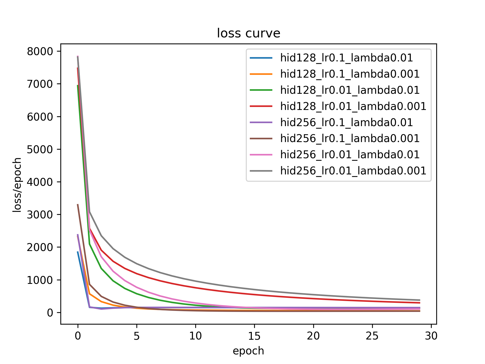
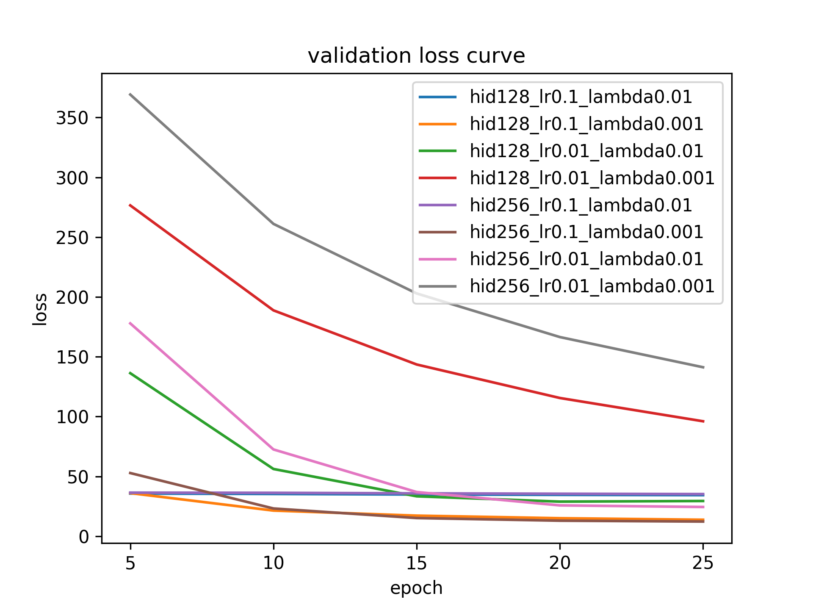
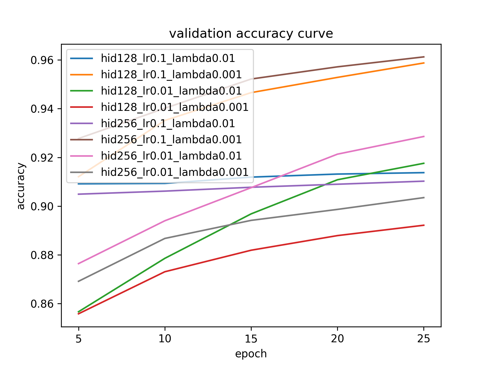
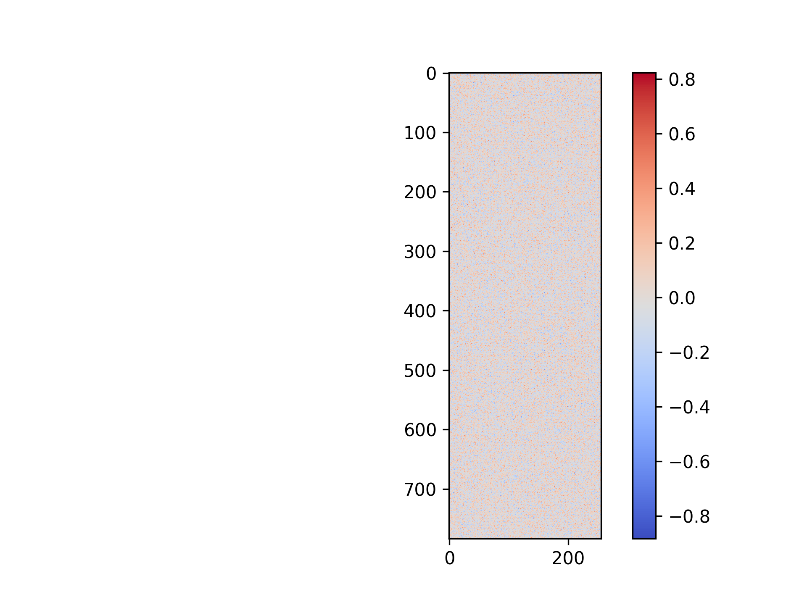
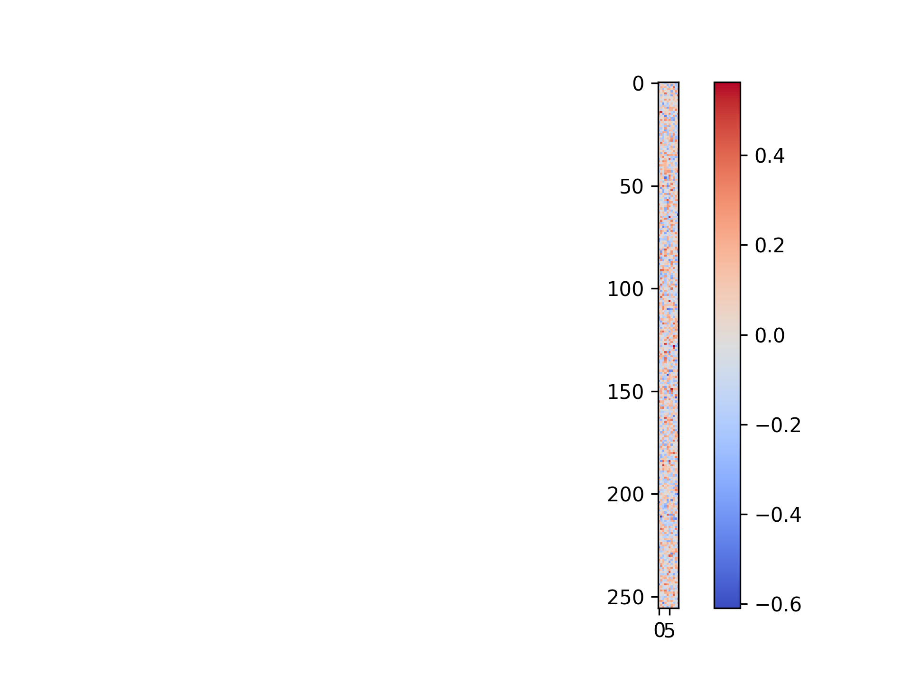
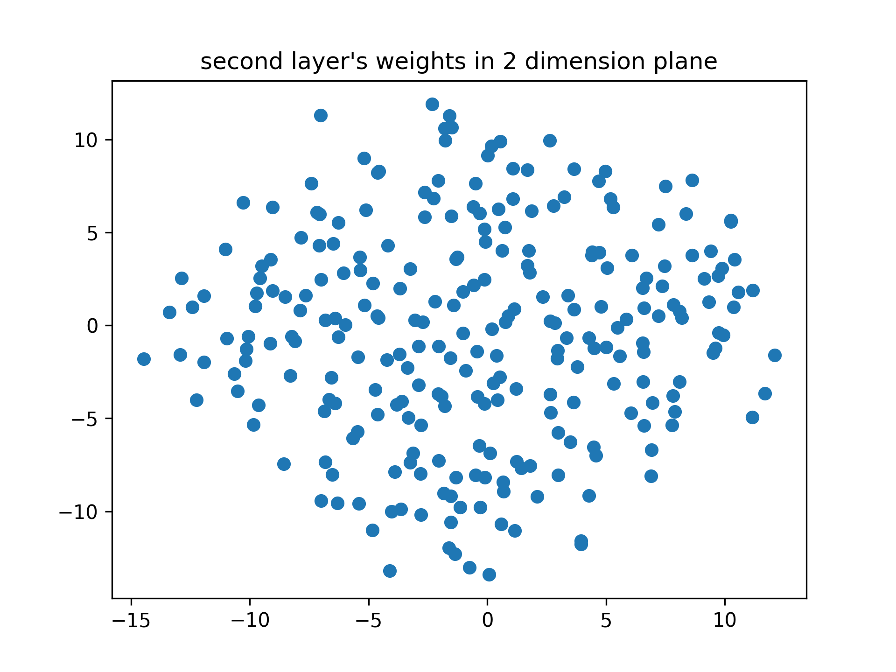

## Assignment1 实验报告
### 模块介绍
#### 全连接层
在Model.py下有类FullyConnectedLayer，可以初始化一个全连接层对象，实现了前向传播(forward)和反向传播(backward)。

其中forward实现的公式为:$$y=XW+b$$backward实现的公式为($\pmb{1}$是全1的列向量)：

$$\frac{\partial{L}}{\partial{W}}=X^T\frac{\partial{L}}{\partial{y}}, \frac{\partial{L}}{\partial{b}}= \pmb{1}^T\frac{\partial{L}}{\partial{y}},\frac{\partial{L}}{\partial{X}}=\frac{\partial{L}}{\partial{y}}W^T$$

具体运算时，先调用forward计算出prediction和损失函数loss，然后调用backward算出对$W,b$的梯度，并保存在self.dW和self.db中，等待优化器的调用，并返回$\frac{\partial{L}}{\partial{X}}$。

#### 激活函数层
在Activate_function.py下有类ReLULayer、SigmoidLayer和SoftmaxLayer，实现了激活函数的前向传播和反向传播(其中SoftmaxLayer只实现forward，反向传播结合CrossEntropyLoss一起实现)。

以ReLULayer为例，forward实现的公式为:
$$y=relu(x)=max(x, 0)$$
backward实现的公式为:
$$\begin{align*}
\begin{split}
\frac{\partial{L}}{\partial{x}}= \left \{
\begin{array}{ll}
    0,                    & x < 0\\
    \frac{\partial{L}}{\partial{y}},     & x \geq 0
\end{array}
\right.
\end{split}
\end{align*}$$

具体调用过程同全连接层，但无参数学习，只需返回$\frac{\partial{L}}{\partial{x}}$。

#### 损失函数层
在Loss_function.py下有类CrossEntropyLoss类，实现了多分类的交叉熵损失函数。

前向传播实现了公式($\pmb{y}$是onehot向量，$\pmb{\hat{y}}$是预测值，经过softmax层)
$$L=-\frac{1}{n}\sum_{i}(\pmb{y}^{(i)})^T\log{\pmb{\hat{y}}^{(i)}}$$
反向传播实现了公式($Y,\hat{Y}$分别是onehot向量和预测值按照batch拼成的矩阵):
$$\frac{\partial{L}}{\partial{X}}=-\frac{1}{n}(Y-\hat{Y})$$
由于损失函数没有上层的梯度回传，也没有参数需要学习，因此直接回传$\frac{\partial{L}}{\partial{X}}$即可。

#### 优化器
在Optimizer.py下有类SGD，实现了基本的随机(批量)梯度下降。可以从模型的get_params()和get_grads()中获取参数和梯度，然后执行如下公式：
$$param = param - lr * grad$$

#### 正则化器
在Regularization.py下有类L2，实现了L2正则。考虑到L2正则也是损失函数，但可以很方便计算对每个参数的梯度，因此与损失函数分开，单独设计。

传入模型model，对每个参数$w$, 梯度可以表示为($\lambda$是正则化强度)：
$$\frac{\partial{L_2}}{\partial{w}}=2\lambda w$$

#### 数据集和加载
在Dataset.py下有Mnist类，从本地路径中加载mnist数据集，并normalize。在Dataloader.py中有DataLoader类，类似于pytorch的DataLoader类，可以lazy加载每一个batch。

#### 模型保存和加载
在FullyConnectedLayer类中实现了save_model()和load_model()，保存了模型参数和超参(模型输入层和输出层的维度)，因此导入模型时无需指定模型的超参，可以全部设置为0。具体可以参考代码。

#### 学习率衰减策略
采用指数衰减策略：每个epoch后，学习率乘以$\gamma$，实验中设为0.99，并设置最小学习率$mini\_lr$，实验中为0.0001。

### 训练流程
划分训练集为80%的训练集和20%的验证集。在训练集上训练，并每隔5个epoch在全部验证集上验证。如果得到更好的验证精度，保存模型参数。训练结束后，用保存的模型参数在测试集上进行一次测试，得到最后的分类结果。由于硬件速率限制，所有参数组合都运行30个epoch。

对学习率$lr$，隐藏层大小$hidden\_dim$，以及正则化强度$lam$进行grid_search：设置三者的取值范围分别为:[0.1, 0.01], [128, 256], [0.01, 0.001]，遍历所有组合的情况，得到最佳的验证集精度及其模型参数，选择该模型参数在最后的测试集上进行测试。

### 结果
训练集loss曲线如下：

<!--  -->
验证集loss曲线如下：

<!--  -->
验证集accuracy曲线如下:

<!--  -->
我们主要关注训练集loss和验证集accuracy的变化。所有的参数组合都在前几个epoch中loss下降极为迅速，并在后续的epoch中速率趋于平缓。学习率0.01(灰、红、粉、绿四条线)相比于0.1要较慢收敛，这也符合理论情况。精度上，(hid, lr, lam)取值为(128, 0.1, 0.001) 或 (256, 0.1, 0.01)时验证集精度能超过96%，且仍有上升的趋势(在迭代50个epoch时，能超过97%)。其余的参数组合都不太理想。

最终选取在验证集上精度最优的参数组合(hid, lr, lam)=(256, 0.1, 0.001)作为模型的超参，并提取其在验证集上保存的参数信息，预测精度为96.25%。

可视化第一层模型参数：(784, hidden_dim)的矩阵：

<!--  -->
降维到(784, 2)后如下所示：

<!--  -->

可视化第二层模型参数：(hidden_dim, 10)的矩阵：

<!--  -->
降维到(hidden_dim, 2)后如下所示：

<!--  -->

### 一些链接
github: https://github.com/hmtbgc/NeuralNetworkAssignment/tree/main/assignment1

模型参数: https://drive.google.com/drive/folders/1UfOjKuoNng31lj7GSlMaxfaTBX7lkOmd?usp=sharing

