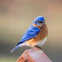
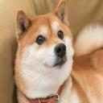
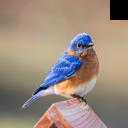
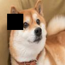
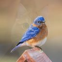
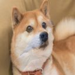
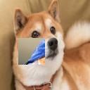

数据集：https://pan.baidu.com/s/1WsH1tpx3l4J-uiJcgSafrw 提取码：6fpf

模型参数：https://pan.baidu.com/s/1-RLdy_0_s1dBDbKFCteUHg 提取码：3jml


### 运行方式


```shell

mkdir data
# 把上述数据集解压放置在data文件夹下
mkdir model_pt
# 把上述模型参数解压放置在model_pt文件夹下

# 运行
python baseline.py -net [vgg16/resnet18/mobilenetv2] -device [cuda:0/cpu] -type [train/test]

python mixup.py -net [vgg16/resnet18/mobilenetv2] -device [cuda:0/cpu] -type [train/test] -alpha [any float]

python cutout.py -net [vgg16/resnet18/mobilenetv2] -device [cuda:0/cpu] -type [train/test]

python cutmix.py -net [vgg16/resnet18/mobilenetv2] -device [cuda:0/cpu] -type [train/test] -alpha [any float]
```


### 问题概述
- 任务: 图像分类
- 数据集: CIFAR-100
- CNN Architecture: VGG16, ResNet18, MobileNetV2
- 数据增强: Mixup, Cutout, Cutmix

Top1 error
|  Method  | Baseline  | Mixup($\alpha=0.4$)|Cutout|Cutmix($\alpha=0.4$)|
|  ----  | ----  |----|----|----|
| VGG16  | 29.32% |27.65%|29.49%|26.70%|
| ResNet18  |24.39% |22.73%|24.72%|22.12%|
|MobileNetV2|33.67%|32.47%|34.57%|36.07%|

Top5 error
|  Method  | Baseline  |Mixup ($\alpha=0.4$)|Cutout|Cutmix($\alpha=0.4$)|
|  ----  | ----  |----|----|----|
| VGG16  | 11.09% |9.36%|11.25%|8.46%|
| ResNet18  |7.47% |6.91%|7.23%|5.89%|
|MobileNetV2|10.11%|9.64%|10.12%|11.43%|

#### Ablation study

1. Mixup $\alpha$, Top1 error

|  Method  | Mixup ($\alpha=0.2$) |Mixup ($\alpha=0.4$)|Mixup ($\alpha=0.6$)|
|  ----  | ----  |----|----|
| VGG16  | 27.66% |27.65%|28.00%|
| ResNet18  | 23.86%|22.73%|23.76%|
|MobileNetV2|33.09%|32.47%|33.82%|

2. Cutmix $\alpha$, Top1 error

|  Method  | Cutmix($\alpha=0.2$) |Cutmix($\alpha=0.4$)|Cutmix($\alpha=0.6$)|
|  ----  | ----  |----|----|
| VGG16  |26.82%  |26.70%|26.57%|
| ResNet18  |22.60% |22.12%|22.19%|
|MobileNetV2|35.86%|36.07%|36.34%|

#### Visualization
raw picture



cutout result



mixup result



cutmix result




