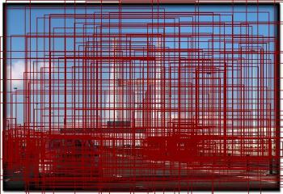
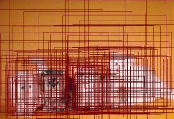
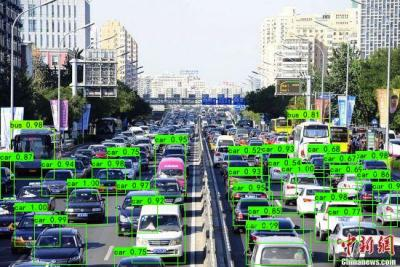
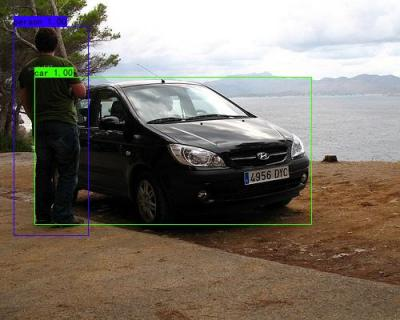

# Assignment2 实验报告

#### 龚畅（负责问题1、Faster-RCNN实验、报告书写汇总） 
#### 郑锦龙（负责FCOS实验、报告书写） 
#### 顾永翀（负责Faster-RCNN和FCOS报告书写）


## 问题1：图像分类
### 数据集介绍
我们采用的是CIFAR-100数据集，该数据集包含100种类别，每种类别有600张大小为32×32的RGB图像。每张图片有粗粒度和细粒度的两种标签，前者有20类，后者有100类。在实验中，我们选取100类的标签。

### 数据划分
针对每类的600张图片，我们选取其中500张为训练集，其余100张为测试集（为了比较公平，我们选用torchvision.datasets.CIFAR100中的train-test划分方式）。同时，随机选取10%的训练集作为验证集，来选取更优参数的模型。

### 网络结构
我们选取三种网络结构来进行比较。

#### VGG16

定义Conv(in, out, k, s, p)表示卷积操作，输入输出通道分别为in，out，卷积核大小为k×k，步长为s, padding为p；MaxPool2d(k, s)表示最大池化操作，池化核为k×k，步长为s。

整体流程：
(3, 32, 32)RGB图像:
-   Conv(3, 64, 3, 1, 1), Conv(64, 64, 3, 1, 1) -> (64, 32, 32)
-   MaxPool2d(2, 2) -> (64, 16, 16)
- Conv(64, 128, 3, 1, 1), Conv(128, 128, 3, 1, 1) -> (128, 16, 16)
- MaxPool2d(2, 2) -> (128, 8, 8)
- Conv(128, 256, 3, 1, 1), Conv(256, 256, 3, 1, 1), Conv(256, 256, 3, 1, 1) -> (256, 8, 8)
- MaxPool2d(2, 2) -> (256, 4, 4)
- Conv(256, 512, 3, 1, 1), Conv(512, 512, 3, 1, 1), Conv(512, 512, 3, 1, 1) -> (512, 4, 4)
- MaxPool2d(2, 2) -> (512, 2, 2)
- Conv(512, 512, 3, 1, 1), Conv(512, 512, 3, 1, 1), Conv(512, 512, 3, 1, 1) -> (512, 2, 2)
- MaxPool2d(2, 2) -> (512, 1, 1)
- Squeeze -> (512, )
- Linear(512, 4096) -> (4096, )
- Linear(4096, 4096) -> (4096, )
- Linear(4096, 100) -> (100, )
- Softmax -> Output

上述过程省略了激活函数、dropout和batch normalization的操作，这些操作的具体位置可以参考源码（一般而言，卷积层后跟BatchNorm2d和ReLU，线性层后跟ReLU和dropout，最后一个线性层后无需跟激活函数和dropout）。

#### ResNet18
定义ResidualBlock(in) 表示一个残差块，包括下面这些层的顺序组合：

Conv(in, in, 3, 1, 1), BatchNorm2d(in), ReLU, Conv(in, in, 3, 1, 1), BatchNorm2d(in), ShortCut, ReLU

其中ShortCut对应于原始论文中的skip-connection。

整体流程：(3, 32, 32) RGB图像：
- Conv(3, 64, 3, 1, 1), BatchNorm2d(64), ReLU -> (64, 32, 32)
- ResidualBlock(64), ResidualBlock(64) -> (64, 32, 32)
- Conv(64, 128, 3, 2, 1) -> (128, 16, 16)
- ResidualBlock(128), ResidualBlock(128) -> (128, 16, 16)
- Conv(128, 256, 3, 2, 1) -> (256, 8, 8)
- ResidualBlock(256), ResidualBlock(256) -> (256, 8, 8)
- Conv(256, 512, 3, 2, 1) -> (512, 4, 4)
- ResidualBlock(512), ResidualBlock(512) -> (512, 4, 4)
- AvgPool -> (512, 1, 1)
- Squeeze -> (512, )
- Linear(512, 100) -> (100, )
- Softmax -> Output

#### MobileNetV2
定义Conv(in, out, k, s, p, groups)表示一个组卷积操作，InvertedResidual(in, out, expansion_rate, s)表示一个逆残差块，其中hidden=in * expansion_rate。该残差块包括以下层：

Conv(in, hidden, 1, 1, 0), BatchNorm2d(hidden), ReLU6, Conv(hidden, hidden, 3, s, 1, hidden), BatchNorm2d(hidden), ReLU6, Conv(hidden, out, 1, 1, 0), BatchNorm2d(out), ShortCut(Optional)

注意，最后的ShortCut只有当s == 1 and in == out 时才奏效。

整体流程：(3, 32, 32) RGB图像：
- Conv(3, 32, 1, 1, 0), BatchNorm2d(32), ReLU6 -> (32, 32, 32)
- InvertedResidual(32, 16, 6, 1) -> (16, 32, 32)
- InvertedResidual(16, 24, 6, 2) -> (24, 16, 16)
- InvertedResidual(24, 24, 6, 1) -> (24, 16, 16)
- InvertedResidual(24, 32, 6, 2) -> (32, 8, 8)
- InvertedResidual(32, 32, 6, 1) -> (32, 8, 8)
- InvertedResidual(32, 32, 6, 1) -> (32, 8, 8)
- InvertedResidual(32, 64, 6, 2) -> (64, 4, 4)
- InvertedResidual(64, 64, 6, 1) -> (64, 4, 4)
- InvertedResidual(64, 64, 6, 1) -> (64, 4, 4)
- InvertedResidual(64, 64, 6, 1) -> (64, 4, 4)
- InvertedResidual(64, 96, 6, 1) -> (96, 4, 4)
- InvertedResidual(96, 96, 6, 1) -> (96, 4, 4)
- InvertedResidual(96, 96, 6, 1) -> (96, 4, 4)
- InvertedResidual(96, 160, 6, 2) -> (160, 2, 2)
- InvertedResidual(160, 160, 6, 1) -> (160, 2, 2)
- InvertedResidual(160, 160, 6, 1) -> (160, 2, 2)
- InvertedResidual(160, 320, 6, 1) -> (320, 2, 2)
- Conv(320, 1280, 1, 1, 0), BatchNorm2d(1280), ReLU6 -> (1280, 2, 2)
- AvgPool -> (1280, 1, 1)
- Conv(1280, 100, 1, 1, 0) -> (100, 1, 1)
- Squeeze -> (100, )
- Softmax -> Output

### 超参设置
无特殊说明，以下超参为所有测试通用
- batch size: 训练验证测试都是128。对每个epoch，都需要打乱训练集和验证集；测试集无需打乱。
- learning rate: 学习率先从0开始线性warm up到0.1，该过程持续一个epoch，然后每训练50个epoch，学习率乘0.2。
- optimizer: SGD，动量momentum为0.9，weight decay为5e-4。
- epoch：共训练200个epoch。
- loss function: CrossEntropyLoss
- 评价指标：accuracy，top1-error(1 - accuracy)，top5-error (1 - ground truth出现在score前5的概率)
- 验证频率：每2个epoch就进行一次验证集测试，以accuracy为是否保存模型参数的标准。

### 数据增强方法
#### Mixup($\alpha$)
先从$\Beta(\alpha, \alpha)$分布中选取$\lambda$，然后混合两个样本：$\hat{x}=\lambda x_1+(1-\lambda)x_2$，损失函数也要混合：$l(\hat{x})=\lambda l(x_1)+(1-\lambda)l(x_2)$。验证和测试时无需混合样本。

#### Cutout
对输入图上随机位置挖去若干块边长为$k$的方形区域，并设置该区域的值为0。实验中，选取$k=8$，并且只挖去一块。验证和测试时无需修剪样本。

#### Cutmix($\alpha$)
先从$\Beta(\alpha, \alpha)$分布中选取$\lambda$，然后在图$x_1$上随机位置挖去一块大小为($\lfloor\sqrt{1-\lambda}w\rfloor, \lfloor\sqrt{1-\lambda}h\rfloor$)的矩形区域，并用另一张图片$x_2$对应区域的内容填充。记挖去区域大小与全图面积大小的比值为$\mu$，则混合后损失函数为$l=(1-\mu)l(x_1)+\mu l(x_2)$。验证和测试时无需混合样本。


### 训练过程
以backbone为ResNet的baseline为例，展示tensorboard结果：


其中损失函数骤降和accuracy骤升的原因是学习率下降(乘0.2)，避免了局部最优解。

其余tensorboard结果可以通过如下方式获取：

```shell
# 先安装tensorboard：pip install tensorboard

cd tensorboard_log
tensorboard --logdir="./baseline/ResNet18" --port 6070

# baseline 和 ResNet18 可以替换成该目录下其他文件夹名称

# 最后打开浏览器，输入：
localhost:6070
```

### 测试结果

#### 不同backbone和数据增强方法的比较
我们考虑四种情形：不加入数据增强(baseline)，Mixup(0.4)，Cutout，Cutmix(0.4)。实验结果如下：

Top1 error
|  Method  | Baseline  | Mixup($0.4$)|Cutout|Cutmix($0.4$)|
|  ----  | ----  |----|----|----|
| VGG16  | 29.32% |27.65%|29.49%|**26.70%**|
| ResNet18  |24.39% |22.73%|24.72%|**22.12%**|
|MobileNetV2|33.67%|**32.47%**|34.57%|36.07%|

Top5 error
|  Method  | Baseline  |Mixup ($0.4$)|Cutout|Cutmix($0.4$)|
|  ----  | ----  |----|----|----|
| VGG16  | 11.09% |9.36%|11.25%|**8.46%**|
| ResNet18  |7.47% |6.91%|7.23%|**5.89%**|
|MobileNetV2|10.11%|**9.64%**|10.12%|11.43%|

针对不同的backbone，ResNet18表现的最好。在top1-error上，VGG16显著优于MobileNetV2；而在top5-error上，两者表现相近。

针对不同的数据增强方法，Mixup和Cutmix都能超过baseline(除了Cutmix在MobileNetV2上表现不佳)，且CutMix普遍优于Mixup。而Cutout难以超越baseline，可能与挖去的方形区域大小有密切联系。

#### 消融实验，针对不同的$\alpha$

1. Mixup $\alpha$, Top1 error

|  Method  | Mixup ($\alpha=0.2$) |Mixup ($\alpha=0.4$)|Mixup ($\alpha=0.6$)|
|  ----  | ----  |----|----|
| VGG16  | 27.66% |**27.65%**|28.00%|
| ResNet18  | 23.86%|**22.73%**|23.76%|
|MobileNetV2|33.09%|**32.47%**|33.82%|

2. Cutmix $\alpha$, Top1 error

|  Method  | Cutmix($\alpha=0.2$) |Cutmix($\alpha=0.4$)|Cutmix($\alpha=0.6$)|
|  ----  | ----  |----|----|
| VGG16  |26.82%  |26.70%|**26.57%**|
| ResNet18  |22.60% |**22.12%**|22.19%|
|MobileNetV2|**35.86%**|36.07%|36.34%|

总的来说，$\alpha$的不同取值对两种数据增强算法的影响较小。

#### 可视化三种数据增强算法
raw picture


mixup result


cutout result


cutmix result


## 问题2：目标检测

### 数据集介绍

VOC2007（Visual Object Classes Challenge 2007）是一个广泛应用于计算机视觉领域的数据集。它是PASCAL VOC（Pattern Analysis, Statistical Modeling, and Computational Learning Visual Object Classes）系列数据集之一，用于目标检测和图像分类任务。VOC2007数据集由20个常见的物体类别组成，每个类别在训练集和测试集中都有大约100张的标记图像。VOC2007数据集的图像都是真实世界的图像，具有真实场景的复杂性和多样性。图像尺寸不一，图像质量和拍摄条件也有所不同。每个图像都有相应的标注文件，提供了物体类别的标签以及物体边界框的位置信息。在目标检测任务中，VOC2007数据集被广泛用于评估算法的性能。

### 数据划分

上表总结了每个类和图像集的对象和图像的数量(至少包含一个给定类的对象)。数据被分成50%用于训练/验证，50%用于测试。在训练/验证集和测试集上，图像和对象的分类分布大致相等。总共有9963张图片，包含24640个带注释的对象。

### Faster-RCNN

#### 网络结构

##### 1. Faster-RCNN整体流程
Faster-RCNN是非常有效的两阶段目标检测算法，训练整个网络需要两个步骤：1.训练RPN网络，2.训练最关键的目标区域检测网络。相较于传统的检测算法，不需要额外的训练分类器和特征表示的过程，整个训练是端到端的。相较于传统算法，Faster-RCNN的准确率得到了大大提升，但速度相较于one-stage的方法慢一点。


首先输入图片，对图片进行深度特征提取，得到feature map,然后通过RPN网络完成传统目标检测算法中滑动窗口所完成的任务（通过anchor生成候选区域），同时完成对候选区域的分类并且RPN网络会对目标的位置进行初步预测。然后通过ROI_Pooling层将候选区域进行一个进一步的位置准确的回归和修正，得到候选区域对应feature map上的对应区域特征，最后通过一个全连接层进一步对候选区域特征进行表示，进行分类和回归操作，来完成对候选区域类别的判断和位置精修。

##### 2. Backbone
本次实验以ResNet-50特征提取网络作为主干网络（backbone network）来发挥作用的。主干网络负责从输入图像中提取特征并为目标检测算法提供高层次的语义信息。

ResNet-50 是一种经典的卷积神经网络结构，由多个卷积层、池化层和残差模块（residual modules）组成。它通过使用残差连接（residual connections）解决了深层网络训练中的梯度消失问题，使得网络可以更容易地训练和优化。ResNet-50 使用了50个卷积层，包括多个残差模块，以提取图像中的特征。在ResNet50网络中，存在两个基本的残差块，分别为Conv block和Identity block，其中Conv block输入和输出维度不一样，所以不能串联，它的作用是改变网络维度；Identity block输入和输出维度一样，可以串联，用于加深网络深度。

在 Faster R-CNN 中，ResNet-50 作为主干网络用于提取输入图像的特征图。它将图像逐层通过卷积和池化操作，逐渐减小特征图的尺寸和维度。这些特征图在后续的区域提议网络（Region Proposal Network，RPN）和目标分类网络中被使用。

##### 3. RPN
RPN 网络是 Faster R-CNN 中的一个子网络，负责生成候选的目标区域提议。它基于主干网络（ResNet-50）提取的特征图，在特征图上滑动一个小的滑动窗口，通过该窗口提取出的特征，预测窗口是否包含目标以及相应的边界框回归信息。RPN 网络通过在特征图上生成anchor boxes来尝试覆盖各种可能的目标大小和宽高比。然后，根据锚框与真实目标框之间的重叠程度，计算锚框的目标得分，并选择得分高的anchor boxes作为目标区域提议proposals。

##### 4. RoI Pooling
RoI Pooling 是 Faster R-CNN 中用于从候选的目标区域提取固定大小的特征表示的操作。一旦 RPN 网络生成了候选目标区域，这些区域需要经过 RoI Pooling 进行处理。RoI Pooling 将每个候选区域划分为固定大小的子区域网格，并对每个子区域进行池化操作，以生成固定长度的特征向量。这种池化操作的目的是将不同大小的目标区域映射到相同的大小，以便后续的目标分类网络能够对这些特征进行处理。

#### 超参设置
目标检测模型里，主干特征提取部分所提取到的特征是通用的，把backbone冻结起来训练可以加快训练效率，也可以防止权值被破坏。

冻结阶段训练参数
- Init_Epoch         = 0
- Freeze_Epoch      = 15
- Freeze_batch_size   = 4
  
解冻阶段训练参数
- UnFreeze_Epoch      = 15
- Unfreeze_batch_size = 2

可以加一个变量控制是否进行冻结训练
- Freeze_Train       = True
- learning rate: Init_lr = 1e-4; Min_lr = Init_lr * 0.01
- optimizer: adam，动量momentum为0.9，weight decay为0。

loss function
```python
def _fast_rcnn_loc_loss(self, pred_loc, gt_loc, gt_label, sigma):
    pred_loc    = pred_loc[gt_label > 0]
    gt_loc      = gt_loc[gt_label > 0]

    sigma_squared = sigma ** 2
    regression_diff = (gt_loc - pred_loc)
    regression_diff = regression_diff.abs().float()
    regression_loss = torch.where(
            regression_diff < (1. / sigma_squared),
            0.5 * sigma_squared * regression_diff ** 2,
            regression_diff - 0.5 / sigma_squared
        )
    regression_loss = regression_loss.sum()
    num_pos         = (gt_label > 0).sum().float()
    
    regression_loss /= torch.max(num_pos, torch.ones_like(num_pos))
    return regression_loss
```
评价指标：mAP

#### 检测结果可视化
train/valid loss 曲线


test mAP


在四张测试图上可视化第一阶段的proposal box



在三张不在VOC数据集的图片上可视化最终检测结果



### FCOS

#### 网络结构


#### 超参设置
- batch size 设为 16，不同GPU显存性能以及内存容量大小需要动态调整
- learning rate： 初始学习率设为2e-3，并在训练过程中逐渐下降，最低为2e-5
- optimizer：SGD，动量momentum为0.9，weight decay为1e-4
- iteration设置为trainset的大小即1252次
- epoch设置为30次，为了减少训练时间可以减少为15次等
- 总体steps即global steps = iteration * epoch
- loss function在loss.py文件中定义，有三个loss，分别是cls loss分类损失，采用交叉熵损失函数、cnt loss中心损失、和reg loss计算iou的损失函数，具体计算和定义在对应文件代码中有详细说明，此处不再赘述。

#### 评价指标，检测/分割结果可视化
利用Tensorboard/wandb都可以在训练测试过程中可视化。由于训练时间开销较大，训练一次周期时间较长，故只展示第一次训练结果后的可视化结果。

- 类别置信度cls loss在每次steps上的损失曲线

- 中心点损失cnt loss 在每次steps上的损失曲线

- 边框回归损失在每次steps上的损失曲线


使用最优的模型测试mAP，结果如下：

```shell
all classes AP=====>

ap for aeroplane is 0.8441736898990535
ap for bicycle is 0.8548483158340914
ap for bird is 0.8466045802312603
ap for boat is 0.6972135403981374
ap for bottle is 0.7103694686916038
ap for bus is 0.8501735262043741
ap for car is 0.9002597213383428
ap for cat is 0.9244805562996358
ap for chair is 0.5594776249373683
ap for dog is 0.893042530759613
ap for horse is 0.8515712361851174
ap for motorbike is 0.8139772241540983
ap for person is 0.8582499979503074
ap for pottedplant is 0.4894317869119832
ap for sheep is 0.8385244665159609
ap for sofa is 0.7091702680052134
ap for train is 0.871275366642313
ap for tvmonitor is 0.8219499004097204
mAP=====>0.792
```

使用10个epoch模型进行测试得到的mAP曲线：


可视化不在VOC数据集（coco数据集）的效果图：


